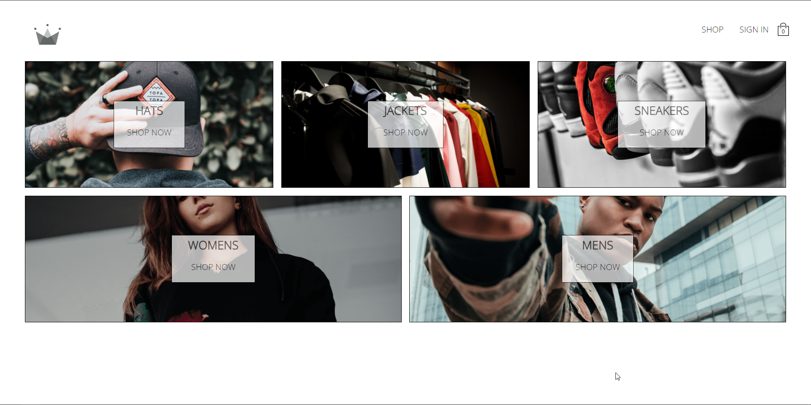

# CRWN Clothing - Online Fashion Store



Welcome to CRWN Clothing, your destination for the latest fashion trends and stylish clothing. This project is a full-fledged online clothing store built using React, Redux, and other modern web technologies to provide an immersive shopping experience.

Check out the deployed project: [CRWN Clothing Website](https://thunderous-figolla-6d2653.netlify.app/)

## Table of Contents

- [Overview](#overview)
- [Features](#features)
- [Installation and Setup](#installation-and-setup)
- [Usage](#usage)
- [Scripts](#scripts)
- [Dependencies](#dependencies)
- [Contributing](#contributing)
- [License](#license)

## Overview

CRWN Clothing is an e-commerce platform where users can browse, select, and purchase a wide variety of clothing items. It's designed to showcase a seamless user experience and efficient handling of online shopping.

## Features

- Rich user interface with Styled Components for enhanced styling.
- State management using Redux for a consistent user experience.
- Integration with Firebase for authentication and database operations.
- Routing and navigation with React Router.
- Asynchronous actions handling with Redux Thunk middleware.
- Dynamic rendering of products with React components.
- Persistent user data using Redux Persist.
- Unit testing with Jest and React Testing Library.

## Installation and Setup

1. Clone the repository:

   ```bash
   git clone https://github.com/your-username/crwn-clothing.git
   cd crwn-clothing
   ```

2. Install project dependencies:

   ```bash
   npm install
   ```

## Usage

To start the development server, run:

```bash
npm start
```

This will launch the application in your browser, allowing you to see the live changes as you edit the code.

To build the project for production, use:

```bash
npm run build
```

The optimized and minified production-ready files will be generated in the `build` directory.

## Scripts

- `start`: Starts the development server.
- `build`: Builds the project for production.
- `test`: Runs tests using Jest.
- `eject`: Ejects the app from `react-scripts` setup.

## Dependencies

- For a comprehensive list of dependencies, please refer to the [`package.json`](package.json) file.

## Contributing

Contributions are welcome! If you find any issues or would like to enhance the project, feel free to create a pull request.

## License

This project is licensed under the [MIT License](LICENSE).
